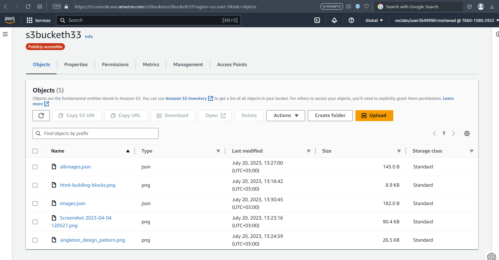
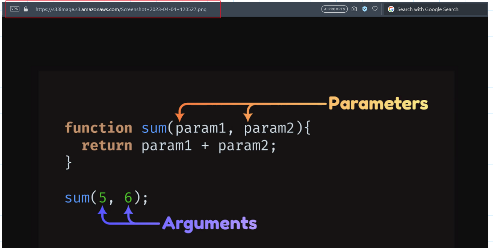
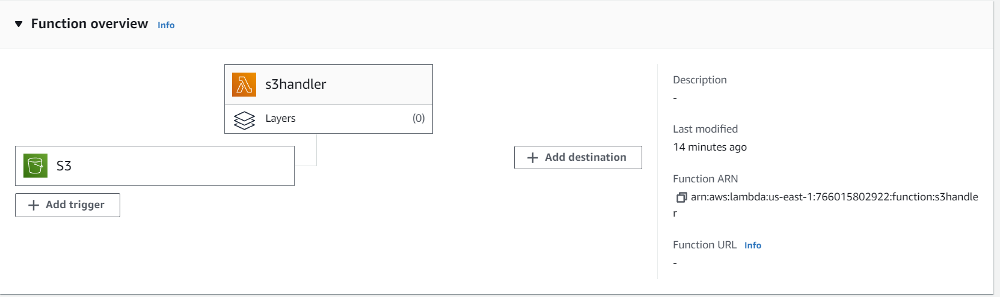
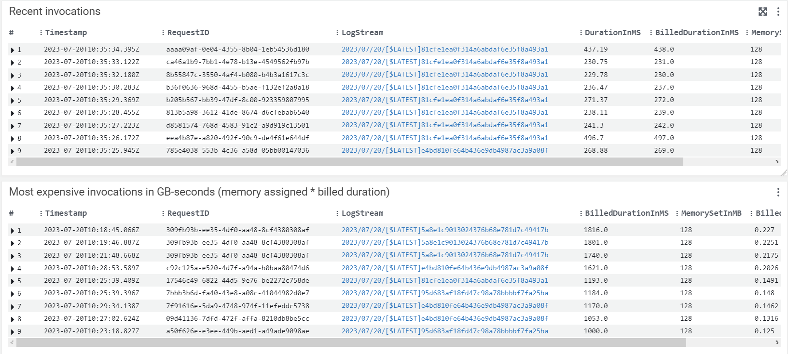
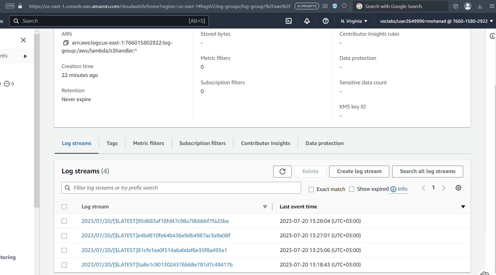
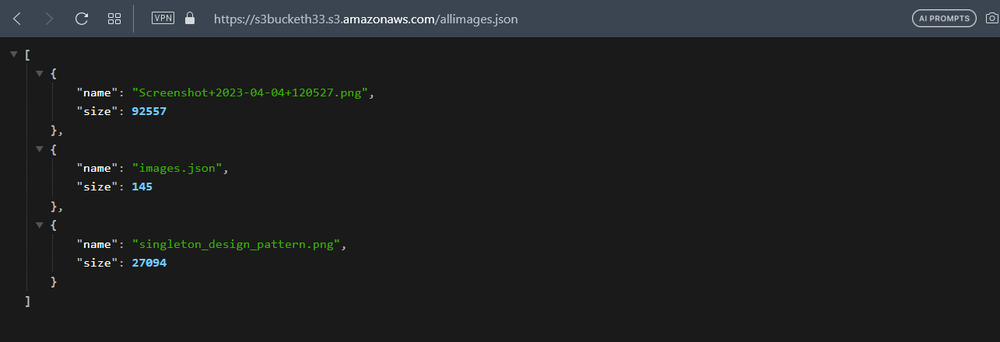

# image-lambda

### s3 bucket

- uplouding the images to s3  
  
- image uploaded :  
  

### lambda function

- connecting with s3  
  

### logs when uploading photos

### the image.json after uploading

